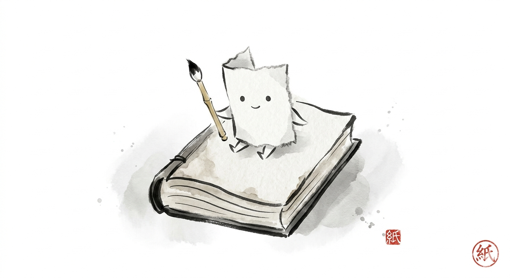

[hon-uranai.html](https://github.com/user-attachments/files/27545976/hon-uranai.html)
<!DOCTYPE html>
<html lang="ja">
<head>
    <meta charset="UTF-8">
    <meta name="viewport" content="width=device-width, initial-scale=1.0">
    <title>本の紙さま占い</title>
    
</head>
<body>

    

        <!-- 本の紙さまイラスト（同じフォルダに paperkami.png を置いてね！） -->
        
        
        <h1 id="title">本の紙さま占い</h1>
        
        <!-- お告げのシンボルが出る場所 -->
        

        

            読みたい本が見つからない？ 
            そんな時は「本の紙さま」に聞いてみよう。 
            今のキミにぴったりのページを開いてくれるぞ！
        

        
        <button class="start-button" id="main-button" onclick="uranai()">お告げを聞く</button>
    

    

</body>
</html>
